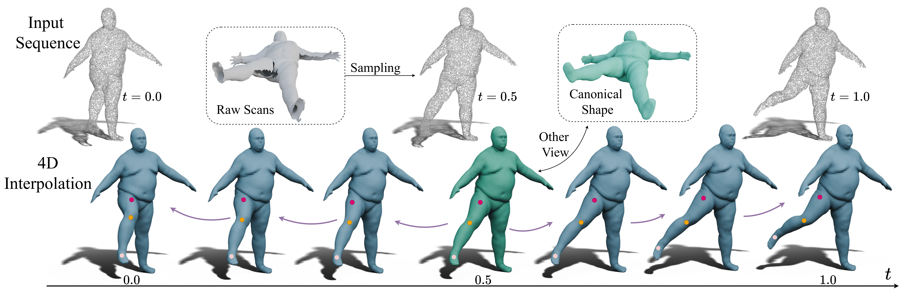

# CanFields: Consolidating Diffeomorphic Flows for Non-Rigid 4D Interpolation from Arbitrary-Length Sequences (ICCV2025)

### [[Project Page](https://wangmiaowei.github.io/CanFields.github.io/)] [[arXiv](https://arxiv.org/abs/2406.18582)] 

Miaowei Wang, Changjian Li, Amir Vaxman <br>

The University of Edinburgh <br>


---


### Abstract

*We introduce Canonical Consolidation Fields (CanFields). This novel method interpolates arbitrary-length sequences of independently sampled 3D point clouds into a unified, continuous, and coherent deforming shape. Unlike prior methods that oversmooth geometry or produce topological and geometric artifacts, CanFields optimizes fine-detailed geometry and deformation jointly in an unsupervised fitting with two novel bespoke modules. First, we introduce a dynamic consolidator module that adjusts the input and assigns confidence scores, balancing the optimization of the canonical shape and its motion. Second, we represent the motion as a diffeomorphic flow parameterized by a smooth velocity field. We have validated our robustness and accuracy on more than 50 diverse sequences, demonstrating its superior performance even with missing regions, noisy raw scans, and sparse data.*

---

## Environment Setup
```bash
# Navigate to the project directory
git clone https://github.com/wangmiaowei/CanFields.git
cd CanFields

# Install additional packages using pip
pip install -r requirements.txt
```

---

## Quick Evaluation

Our algorithm has been tested on multiple datasets. Below is the quick evaluation process for the raw scanned sequence `one_leg_loose` as presented in Fig. 10.

```bash
# Navigate to raw scanned sequence
# '4k_pc' contains sampled points as input, 'gt_mesh' consists of raw scans.
cd datasets/Deforming4D/notexture/50002_one_leg_loose_1 

# Check our reconstructed results
cd ../../../..  # Adjusting the directory path to reach root
cd results/manifold

# Access provided pretrained weights
cd ../..  # Adjusting to the weights directory
cd exp_res/formulation/ode_solve

# Step 1: Generate the consolidated canonical shape
cd ../../..
python eval_sphere.py -d animals -e 15000 -s 1 -o 50002_one_leg_loose_1_full_l2_0.05_elas_0.05_prob_0.01_start_id_0_gap_15_stride_1 -m False

# Step 2: Generate the reconstructed results
python eval_sphere.py -d animals -e 15000 -s 2 -o 50002_one_leg_loose_1_full_l2_0.05_elas_0.05_prob_0.01_start_id_0_gap_15_stride_1 -m False
```

---

## Fitting from Raw Scans

To train CanFields using sampled points from raw scans, execute:

```bash
# Train CanFields
python train_debugV2.py -a 0.05,0.05,0.01 -o 50002_one_leg_loose_1 -d animals -u True -m False -c 0,15,1 -ev 7000
```

---
## Citation

   If you find our repo useful for your research, please consider citing our paper:

   ```bibtex
    @InProceedings{CanFields2025,
    title={CanFields: Consolidating Diffeomorphic Flows for Non-Rigid 4D Interpolation from Arbitrary-Length Sequences},
    author={Wang, Miaowei and Li, Changjian and Vaxman, Amir},
    booktitle={Proceedings of the IEEE/CVF International Conference on Computer Vision (ICCV)},
    year={2025}}
   ```
